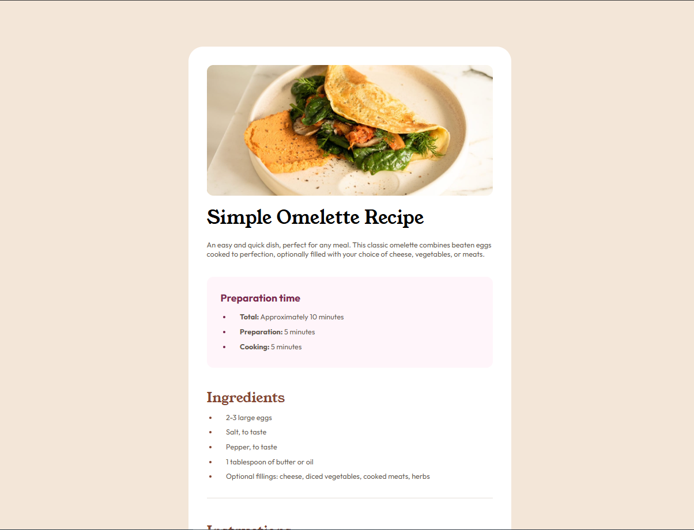
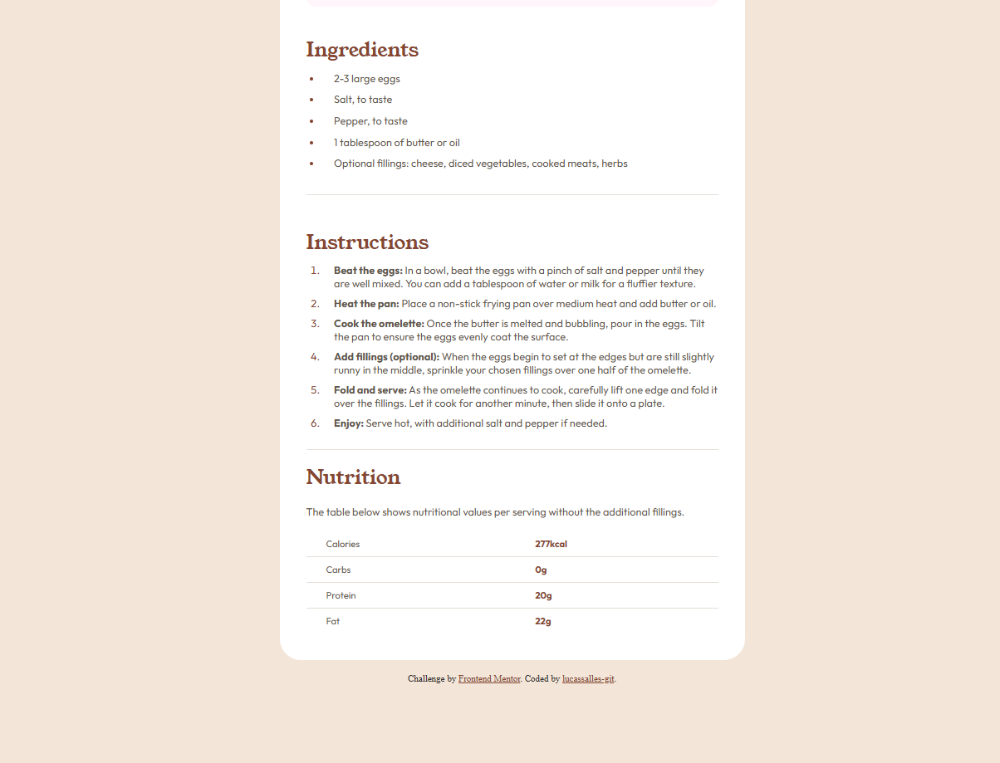

# Frontend Mentor - Recipe page solution

This is a solution to the [Recipe page challenge on Frontend Mentor](https://www.frontendmentor.io/challenges/recipe-page-KiTsR8QQKm).

## Table of contents

- [Overview](#overview)
  - [The challenge](#the-challenge)
  - [Screenshot](#screenshot)
  - [Links](#links)
- [My process](#my-process)
  - [Built with](#built-with)
  - [What I learned](#what-i-learned)
  - [Continued development](#continued-development)
  - [Useful resources](#useful-resources)
- [Author](#author)
- [Acknowledgments](#acknowledgments)

## Overview

### Screenshot




### Links

- Solution URL: [Add solution URL here](https://your-solution-url.com)
- Live Site URL: [Add live site URL here](https://your-live-site-url.com)

## My process

### Built with

- Semantic HTML5 markup
- CSS custom properties
- Flexbox
- Mobile-first workflow

### What I learned

Semantic tags to create a table:

```html
<table>
  <tbody>
    <tr>
      <td>Calories</td>
      <td class="grams">277kcal</td>
    </tr>
  </tbody>
</table>
```

Styling dots in a ul or numbers in an ol using the ::marker pseudo element:

```css
.preparation li::marker {
  color: var(--rose-800);
}
```

Use of the :not(.final) pseudo-class, which in the example selects all elements that do not have the "final" class:

```css
.nutrition td:not(.final) {
  border-bottom: 1px solid var(--stone-150);
}
```

## Author

- Website - [Add your name here](https://www.your-site.com)
- Frontend Mentor - [@lucassalles-git](https://www.frontendmentor.io/profile/lucassalles-git)
- GitHub - [lucassalles-git](https://github.com/lucassalles-git)
